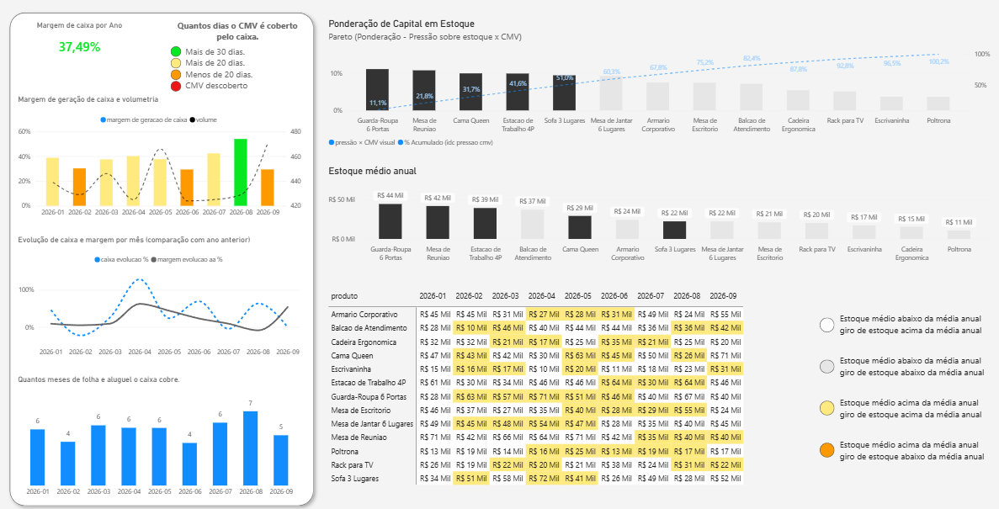
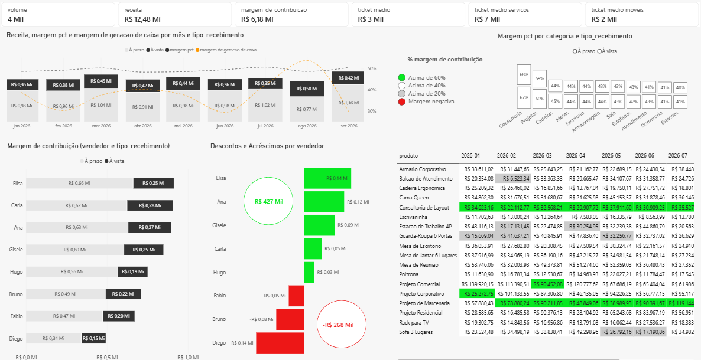

## Resumo
Este estudo faz parte de uma coleção cujo objetivo é análise comercial. A estruturação de métricas, indicadores e KPIs é um dos pontos-chave do estudo, alinhada ao olhar analítico objetivando a solução para um problema de negócio. <br>
Todos os dados usados como fonte são fictícios e apenas para estudo.

Um objetivo secundário é exercitar habilidades importantes como:
Modelagem de dados;
Storytelling;
Organização;
Medidas DAX;
Power BI;

## Uso de IA.
Neste estudo a IA foi utilizada para o seguinte fim:<br>
**Proposição**: Foi enviado um prompt no Claude code, solicitando um estudo de caso com a finalidade de exercitar análise de dados voltada para àrea comercial. Como resultado do prompt foi obtido um conjunto de bases e um arquivo descrevendo o problema de negócio. <br>

## Problema de negócio
A direção percebe crescimento de vendas, mas não sabe:

- se crescimento de receita está se convertendo em caixa;
- quais produtos consomem capital em estoque;
- quais vendedores geram mais receita e margem;
- se maior faturamento significa maior contribuição econômica.

## Limitações metodologicas do estudo.
**Estoque médio**: Na base apresentada não há a evolução de estoque dentro de cada mês, por isso considera-se aqui para efeito de estudo que o estoque médio é snapshot do mês anterior + snapshot do mês atual / 2. <br>

**Níveis de Estoque**: Não há informações de prazo de entrega dos fornecedores na base, impossibilitando a implementação de medidas para obter EMI (Estoque Mínimo), EMA (Estoque Máximo) e EM (Estoque Médio) e ES (Estoque de segurança). <br>

**Compras por linha de produto**: Não há na base de compras uma distinção entre compras para fabricação, moveis prontos, consultoria e projetos; sendo as saídas apresentadas apenas como compra de estoque. Como as linhas de Projetos e Consultoria são diferentes da linha de móveis prontos, a análise de caixa segmentada por categoria fica inviável. <br>

## Investigando o financiamento externo da operação.
A **margem de geração de caixa *¹** permanece entre 35% e 37% ao longo do período disponível na base de fluxo de caixa, no entanto quando analisamos a capacidade de cobrir a operação usando o caixa, notamos que o valor é insuficiente para cobrir o **CMV *²** cobrindo em média 20 dias deste indicador. Foi observado também que os custos fixos (Aluguel e Folha) são cobertos de forma segura pelo caixa, em torno de 4 meses de cobertura a cada mês de caixa.
O fato de possuir cobertura relativamente baixa do CMV indica que a operação é financiada, mas a falta de dados na base impossibilita a concluir se o financiamento é externo ou se a cobertura é dada exclusivamente por Contas a Receber. <br>

*¹ margem de geracao de caixa = DIVIDE([caixa],[receita])<br>
*² cmv = SUMX(fato_vendas,fato_vendas[quantidade]*(fato_vendas[custo_mercadoria]/fato_vendas[quantidade])) 

### Analisando a pressão de estoque.
Com a finalidade de saber quais produtos causam maior pressão no estoque por terem estoque médio alto e giro baixo, foram implementadas algumas medidas. <br>

Avaliando giro, estoque medio e cmv:

**Estoque medio** 
```DAX
estoque medio valor = 
var estoque_inicial = 
CALCULATE(SUMX(fato_estoque_mensal,fato_estoque_mensal[valor_estoque]),DATEADD(dim_calendario[Início do Mês],-1,MONTH))
var estoque_final = 
CALCULATE(SUMX(fato_estoque_mensal,fato_estoque_mensal[valor_estoque]))
var estoque_medio = (estoque_inicial + estoque_final)/2
RETURN estoque_medio
```

**Giro** 
```DAX
giro de estoque valor = ROUNDUP(CALCULATE(DIVIDE([cmv],[estoque medio valor]),ALLEXCEPT(dim_calendario,dim_calendario[Ano])),2)
```

**Indice de pressao** 
```DAX
idc de pressao de estoque = 
var ema = [estoque medio valor anual]
var giro = [giro de estoque valor anual]
RETURN CALCULATE(DIVIDE(DIVIDE([estoque medio valor],ema),DIVIDE([giro de estoque valor anual],giro)),ALLEXCEPT(dim_calendario,dim_calendario[Ano]))
```

A combinação desses indicadores oportunizou saber quais produtos são críticos para o estoque.
Os produtos mais pressionados são:
Guarda-Roupa 6 Portas
Cama Queen
Poltrona

Os produtos menos pressionados são:
Balcao de Atendimento
Armario Corporativo
Rack para TV

Embora essa primeira análise tenha oferecido uma descoberta valiosa, ainda havia uma questão importante: Esses produtos com dinâmica crítica são também relevantes financeiamente?
Ao classificarmos estes produtos pelo CMV, notamos que a Poltrona tem baixa relevância. Para criar uma medida que também considerasse o CMV, foi criada a medida (pressão × CMV = 
[idc de pressao de estoque] * [cmv]).

Utilizando abordagem de Pareto, é possível visualizar automaticamente os produtos que causam maior pressão ponderada pelo capital imobilizado. <br>


Com essa nova abordagem notamos que em 2026, os produtos mais pressionados com alto cmv são:<br>
- Guarda-Roupa 6 Portas<br>
- Mesa de Reuniao<br>
- Cama Queen<br>

*Nota-se que, embora pressionada, a poltrona tem o menor cmv do ano de 2026

## Vendas
Após análise, podemos verificar alguns pontos interessantes:
Descontos concedidos: Um percentual de descontos concedidos pelos vendedores é de aproximadamente 5% ao longo dos três anos. <br>
A margem de contribuição variou entre 48% e 52% ao longo dos três anos.<br>



## Conclusões

O crescimento de receita está se convertendo em caixa?
Sim, está, mas em nível baixo em relação ao tamanho do negócio. O caixa é baixo devido a baixa liquidez. O faturamento com prazo de recebimento até 7 dias representa 30% de todo o faturamento, e o fato de 70% do faturamento ser recebido a partir de 15 dias atrasa a disponibilidade em caixa. <br>
O KPI [dias de caixa] cobre mais de 30 dias somente em Agosto/26. A margem de geração de caixa varia entre 34% e 40% ao longo dos 3 anos de operação. A combinação dos KPIs [dias de caixa] e [margem de geração de caixa] indicam que o negócio não gera caixa suficiente para cobrir a operação, apesar do faturamento crescente. <br>

quais produtos consomem capital em estoque?
O top 3 em 2026:<br>
- Guarda-Roupa 6 Portas
- Mesa de Reuniao
- Cama Queen

Quais vendedores geram mais receita e margem?
Analisando o período completo, Ana, Elisa e Gisele performaram melhor. Considerando 2026; Elisa, Carla e Ana.

Faturamento significa maior contribuição econômica?
Sim, considerando as variáveis receita e margem, a correlação é forte. Porém quando observadas as variáveis receita e caixa, a correlação é fraca, mas também com tendência positiva.

### Recomendações para aumentar o caixa disponível:
- Negociar melhores prazos de pagamento de fornecedores: Dado que a maior parte dos custos é composta de pagamento de fornecedores, e não temos na base a informação de quantos fornecedores, quais prazos de entrega e como é o contrato de fornecimento. Existe a possibilidade de selecionar adequadamente os fornecedores com objetivo de reduzir juros de financiamento, negociar prazos maiores ou reduzir preços.

- Incentivar entradas maiores dos clientes: Uma vez que 70% das vendas é recebida à prazo, pode-se realizar um estudo de elaticidade para verificar se os produtos críticos para o estoque teriam suas vendas sustentadas mesmo com entradas maiores.

- Realizar promoções: Com o objetivo de aumentar o giro de estoque, seria uma possibilidade realizar queima de estoque. E realizar um estudo para saber se um ajuste no mix de produtos impactaria positivamente a operação.

Alinhada às recomendações anteriores, seria uma boa prática a definição de atividades realistas para acompanhar a evolução para atingimento das metas.<br>

- Reunir semanalmente com pelo menos 1 possível novo fornecedor para sondar vantagens de financiamento e prazo;
- Ofertar vantagens para clientes que possam pagar entradas maiores (Descontos, cupons ou serviços).
- Enviar mensagens para os clientes que se interessaram pelos produtos que causam pressão no estoque apresentando oferetas especiais.

### Próximas etapas.
Para um próximo estudo, as bases serão enriquecidas com dados mais detalhados que oportunizem realizar DRE, e também análise de cenários em que implemento as recomendações aqui propostas. Crescendo também a arquitetura, utilizando banco de dados.


